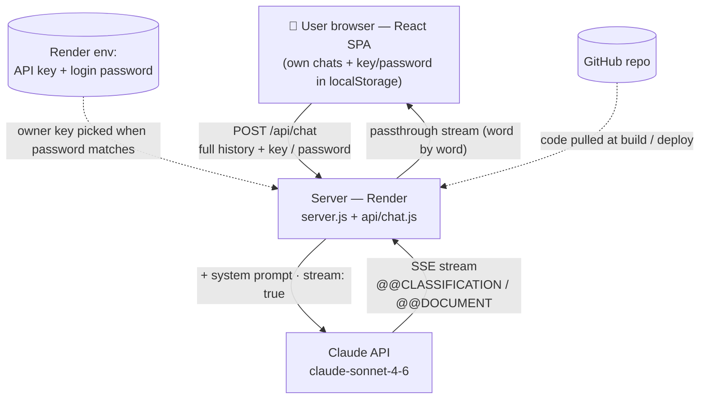

# BA Requirements Assistant

> Turns raw meeting notes, call transcripts and chat logs into a **structured business‑requirements document** — through a guided, staged dialogue powered by Claude.
>
> Сырой текст (заметки со встреч, транскрипты созвонов, переписку) превращает в **структурированный документ требований** — через пошаговый диалог на базе Claude.

<p>
  
  
  
  
</p>

**🌐 Live:** https://ba-requirements-assistant-fin.onrender.com
*(free tier — the server sleeps when idle, so the first request may take ~30 s to wake up)*

**Language / Язык:** **[English](#english)** · **[Русский](#русский)**

---

## English

### What it is

A personal AI agent for business analysts. You paste unstructured input — a call transcript, an email thread, scattered notes — and the assistant walks you through producing a clean requirements document instead of dumping a wall of text at you.

It deliberately works in **stages**:

1. **Classification** — the model assesses the task (complexity level, domains, risks) and proposes a document structure plus the critical questions worth answering first.
2. **Your input** — you toggle which sections to keep and answer (or skip) the questions.
3. **Document** — only then does it assemble the full document (context, scope, business rules, functional requirements with IDs, etc.) into a side panel, where every revision is saved as a version.

The BA methodology itself lives in a large Russian system prompt (`api/systemPrompt.js`): a 4‑level task classification, domain triggers, FR/BR/NFR identifiers and explicit contradiction handling.

### How it works

Three mechanisms carry the whole experience:

- **`@@` markers** — every model reply starts with a single marker on the first line, and the UI uses it to decide *what to render*: `@@CLASSIFICATION` → a card, `@@DOCUMENT::title` → the document panel, `@@CONFLICT` → a "contradiction found" card, `@@MESSAGE` → a normal chat bubble.
- **Streaming** — requests use `stream: true`; the server passes the Anthropic SSE stream straight through to the browser, so text appears word‑by‑word in ~1–2 s instead of after a long blank wait.
- **Staged flow** — a first‑turn rule on the server forces the very first reply to be a classification; the document is produced only after you confirm the structure.



### Features

- **Staged dialogue** — classification → clarifying questions → document; never jumps straight to the document.
- **Live structured cards** — task level, risks, domains and suggested sections, all driven by the model's actual output (not a static mock‑up).
- **Streaming output** with an elapsed timer.
- **Document panel with versions** — rename / copy / delete each version; revisions are returned as a full updated document, so versions accumulate.
- **Saved chats** in the browser — auto‑title, rename, delete one / delete all.
- **File attachments** — images and PDF, sent as native Anthropic content blocks.
- **Multi‑user without accounts** — each browser is isolated via its own `localStorage`. Users either bring their own Anthropic key (stored locally, never sent to the owner) or sign in with a shared password (the server then uses the owner's key, which never reaches the browser).
- **Prompt caching** of the large system prompt, and `max_tokens: 16000` so even very long documents complete in full.

### Tech stack

| Area | Choice |
|---|---|
| Frontend | React 19, Vite 8, inline styles, `react-markdown` + `remark-gfm` |
| Model | Anthropic Messages API · `claude-sonnet-4-6` · streaming (SSE) |
| Backend (prod) | Express 5 (`server.js`) on Render — serves the built SPA and `/api/chat` |
| Backend (dev) | Custom Vite plugin serving `/api/chat` locally |
| HTTP to Anthropic | `undici` `fetch` + custom `Agent` (generous timeouts for large PDF/image uploads) |
| Storage | Browser `localStorage` (chats, key/password) — no database |

### Project structure

```
ba-requirements-assistant/
├── api/
│   ├── chat.js          # API handler: auth, prompt assembly, SSE streaming
│   └── systemPrompt.js  # BA methodology — the agent's "brain"
├── src/
│   ├── App.jsx          # Whole UI: chat, cards, document panel, sidebar
│   ├── index.css · App.css
│   └── main.jsx
├── server.js            # Express server for Render (serves dist/ + /api/chat)
├── vite.config.js       # Dev server + local /api/chat plugin
└── package.json
```

### Run locally

```bash
# 1. Install
npm install

# 2. Add your key — create .env.local in the project root:
#    ANTHROPIC_API_KEY=sk-ant-...
#    APP_PASSWORD=your-password   # optional: enables password login
# (.env.local is gitignored — it never goes to the repo)

# 3. Start the dev server
npm run dev
```

### Deploy (Render)

- **Build command:** `npm install && npm run build`
- **Start command:** `npm start` (runs `server.js`)
- **Environment variables:** `ANTHROPIC_API_KEY`, `APP_PASSWORD`

Pushing to the GitHub repo triggers an automatic redeploy.

### Roadmap

- Accounts + database so chats sync across devices.
- Export to Word / Confluence.
- Optional English methodology alongside the Russian one.

---

## Русский

### Что это

Личный AI‑агент для бизнес‑аналитика. Вставляешь неструктурированный текст — транскрипт созвона, переписку, разрозненные заметки — и ассистент **проводит тебя по шагам** до готового документа требований, а не вываливает сразу «простыню».

Работает осознанно **в несколько ходов**:

1. **Классификация** — модель оценивает задачу (уровень сложности, домены, риски) и предлагает структуру документа плюс критичные вопросы.
2. **Твой ввод** — отмечаешь, какие разделы оставить, и отвечаешь (или пропускаешь) вопросы.
3. **Документ** — только после этого собирается полный документ (контекст, scope, бизнес‑правила, функциональные требования с ID и т. д.) в правую панель, где каждая правка сохраняется как версия.

Сама методология аналитика живёт в большом русском системном промпте (`api/systemPrompt.js`): классификация задачи по 4 уровням, доменные триггеры, идентификаторы FR/BR/NFR и обработка противоречий.

### Как это устроено

Всё держится на трёх механизмах:

- **Метки `@@`** — каждый ответ модели начинается с одной метки на первой строке, и интерфейс по ней решает, *что рисовать*: `@@CLASSIFICATION` → карточка, `@@DOCUMENT::заголовок` → панель документа, `@@CONFLICT` → карточка «нашёл противоречие», `@@MESSAGE` → обычная реплика в чате.
- **Стриминг** — запросы идут с `stream: true`; сервер пробрасывает SSE‑поток Anthropic прямо в браузер, поэтому текст печатается по словам за ~1–2 с, а не появляется после долгого пустого ожидания.
- **Пошаговый сценарий** — правило первого хода на сервере заставляет самый первый ответ быть классификацией; документ собирается только после подтверждения структуры.

> Схема выше (блок Mermaid в английской части) одинаково описывает работу в интернете: браузеры людей → сервер на Render → Claude, плюс переменные Render с ключом/паролем и GitHub, отдающий код при деплое.

### Возможности

- **Пошаговый диалог** — классификация → уточняющие вопросы → документ; не прыгает сразу к документу.
- **Живые структурные карточки** — уровень задачи, риски, домены и предлагаемые разделы строятся по реальному ответу модели (а не статичный мокап).
- **Стриминг ответа** с таймером ожидания.
- **Панель документа с версиями** — переименование / копирование / удаление каждой версии; правка возвращается полным обновлённым документом, поэтому версии накапливаются.
- **Сохранённые чаты** в браузере — авто‑заголовок, переименование, удаление одного / всех.
- **Вложения** — картинки и PDF, отправляются нативными блоками Anthropic.
- **Многопользовательский режим без аккаунтов** — каждый браузер изолирован своим `localStorage`. Пользователь либо вводит свой ключ Anthropic (хранится локально, владельцу не уходит), либо входит по паролю (тогда сервер использует ключ владельца, который никогда не попадает в браузер).
- **Кэширование** большого системного промпта и `max_tokens: 16000`, чтобы даже очень длинные документы доходили целиком.

### Стек

| Область | Решение |
|---|---|
| Фронтенд | React 19, Vite 8, инлайн‑стили, `react-markdown` + `remark-gfm` |
| Модель | Anthropic Messages API · `claude-sonnet-4-6` · стриминг (SSE) |
| Бэкенд (прод) | Express 5 (`server.js`) на Render — отдаёт собранный SPA и `/api/chat` |
| Бэкенд (дев) | Кастомный Vite‑плагин, поднимающий `/api/chat` локально |
| HTTP к Anthropic | `undici` `fetch` + свой `Agent` (щедрые таймауты под крупные PDF/картинки) |
| Хранение | `localStorage` браузера (чаты, ключ/пароль) — без базы данных |

### Запуск локально

```bash
# 1. Установить зависимости
npm install

# 2. Добавить ключ — создай .env.local в корне проекта:
#    ANTHROPIC_API_KEY=sk-ant-...
#    APP_PASSWORD=твой-пароль   # необязательно: включает вход по паролю
# (.env.local в .gitignore — в репозиторий не попадает)

# 3. Запустить дев‑сервер
npm run dev
```

### Деплой (Render)

- **Build command:** `npm install && npm run build`
- **Start command:** `npm start` (запускает `server.js`)
- **Переменные окружения:** `ANTHROPIC_API_KEY`, `APP_PASSWORD`

Пуш в GitHub‑репозиторий автоматически запускает пересборку.

### Планы

- Аккаунты + база данных, чтобы чаты синхронизировались между устройствами.
- Экспорт в Word / Confluence.
- Опциональная англоязычная методология рядом с русской.

---

*Built by [@gennodelf](https://github.com/gennodelf) — a business analyst learning to ship real tools.*
